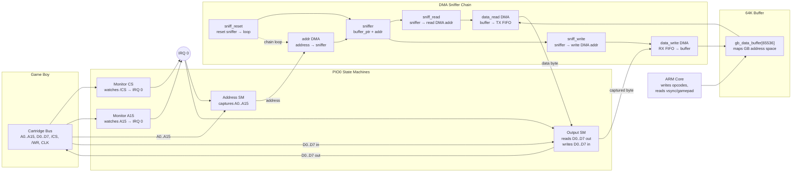

# GBIO Address & Data Flow Architecture

## How it works

1. **Monitor SMs** watch `/CS` and `A15`. When either goes low, they clear IRQ 0 — signaling "an access is starting."

2. **Address SM** wakes up on IRQ 0 cleared, captures the 16-bit address from A0..A15 into its RX FIFO.

3. **DMA chain** processes the address:
   - `addr DMA` sends the address into the **sniffer**, which adds it to the buffer base pointer (`buffer_ptr + address`)
   - For **reads**: `sniff_read` copies the sniffer result into `data_read`'s source address → `data_read` fetches the byte from the buffer and pushes it into the Output SM's TX FIFO → Output SM drives D0..D7 onto the bus
   - For **writes**: `sniff_write` copies the sniffer result into `data_write`'s destination address → Output SM captures D0..D7 into its RX FIFO → `data_write` stores it in the buffer at the right offset
   - `sniff_reset` resets the sniffer back to the buffer base, and the chain loops

4. **64K buffer** is the shared memory: the ARM core writes SM83 opcodes here, and the PIO/DMA hardware serves bytes automatically on every Game Boy access.
