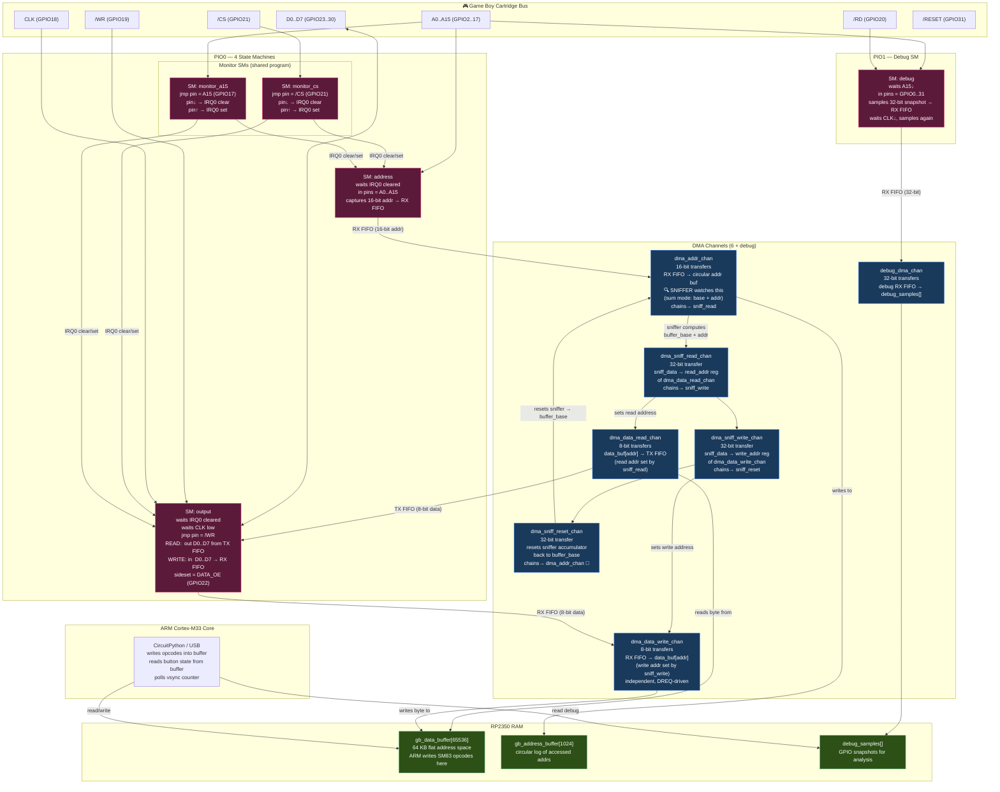

# GBIO Architecture — Address & Data Flow



## How It Works

The RP2350 acts as a **Game Boy cartridge**. A 64 KB buffer in RAM (`gb_data_buffer`) maps the entire Game Boy address space. PIO state machines and DMA serve reads/writes automatically — the ARM core is free to run Python/USB.

### Read Cycle (Game Boy reads from cartridge)

| Step | Who | What |
|------|-----|------|
| 1 | **Monitor CS SM** | /CS goes low → clears PIO IRQ0 |
| 2 | **Address SM** | Sees IRQ0 cleared, captures A0..A15 into RX FIFO |
| 3 | **dma_addr_chan** | Copies 16-bit address from RX FIFO → circular buffer. **Sniffer** (in sum mode, seeded with `buffer_base`) computes `buffer_base + address` |
| 4 | **dma_sniff_read_chan** | Copies sniffer result into `dma_data_read_chan`'s **read-address register** (chains from step 3) |
| 5 | **dma_data_read_chan** | Reads byte from `gb_data_buffer[address]` → Output SM's **TX FIFO** |
| 6 | **Output SM** | Waits for CLK low, sees /WR high (read), outputs byte on D0..D7 with DATA_OE asserted |
| 7 | **dma_sniff_write_chan** | Copies sniffer into `dma_data_write_chan`'s write-address register (chains from step 4) |
| 8 | **dma_sniff_reset_chan** | Resets sniffer accumulator back to `buffer_base` (chains from step 7) |
| 9 | 🔁 chains back to **dma_addr_chan** — ready for next access |

### Write Cycle (Game Boy writes to cartridge)

Same as read through step 4, then:

| Step | Who | What |
|------|-----|------|
| 5w | **dma_sniff_write_chan** | Sets `dma_data_write_chan`'s write address to `buffer_base + address` |
| 6w | **Output SM** | Sees /WR low (write), captures D0..D7 into **RX FIFO** |
| 7w | **dma_data_write_chan** | Copies byte from RX FIFO → `gb_data_buffer[address]` (independent channel, DREQ-driven) |

### Key Design Details

- **Sniffer trick**: The DMA sniffer in "sum mode" acts as an address adder. Seeded with the buffer base pointer, adding the 16-bit address yields the exact buffer offset — no CPU intervention needed.
- **Two monitors**: Both /CS and A15 are monitored because the Game Boy can assert either to start an access. They share one PIO program but use different `jmp_pin` configs.
- **DATA_OE sideset**: The output SM controls the level-shifter's output-enable via a sideset pin, ensuring the RP2350 only drives the data bus during reads (and releases it for writes).
- **Debug PIO**: A separate PIO1 SM captures full 32-bit GPIO snapshots on every A15 falling edge + CLK low, DMA'd to a buffer for post-mortem analysis.

### DMA Chain Order

```
dma_addr_chan → dma_sniff_read_chan → dma_sniff_write_chan → dma_sniff_reset_chan → dma_addr_chan (loop)
                    |                         |
                    v                         v
            dma_data_read_chan        dma_data_write_chan
            (read addr updated)       (write addr updated)
```

`dma_data_read_chan` and `dma_data_write_chan` are **not** in the chain — they are triggered by PIO DREQ signals (TX FIFO empty / RX FIFO not empty) and their address registers are updated by the sniffer channels.

### Pin Map (PyGameBoy RP2350 v8 PCB)

| Signal | GPIO | Direction |
|--------|------|-----------|
| A0..A15 | 2..17 | Input (SIO) |
| CLK | 18 | Input |
| /WR | 19 | Input |
| /RD | 20 | Input |
| /CS | 21 | Input |
| DATA_OE | 22 | Output (PIO sideset) |
| D0..D7 | 23..30 | Bidirectional (PIO) |
| /GB_RESET | 31 | Output (GPIO) |
| DEBUG_LED | 45 | Output (GPIO) |
